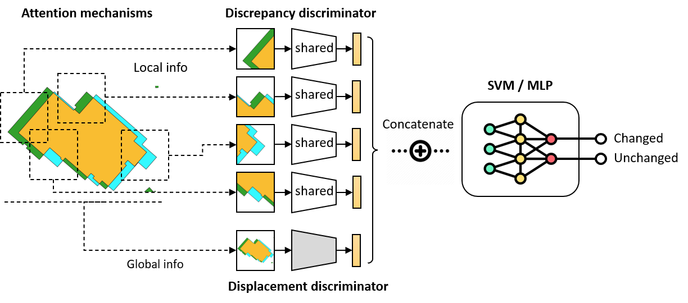

# BCDWorkflow: A Workflow of Building Footprints Change Detection
<br/>
This repository contains the implementation of the multi-stage deep learning workflow proposed in the paper:
<br/><br/>
"A workflow of deep models with concept learning and domain-specific attention for change detection in vector building footprints"
<br/><br/>Xiang Zhang, Ruolan Li, Yilang Shen

## 📌 Overview
<br/>
The study addresses a challenging change detection problem in heterogeneous vector building footprints, where pseudo-changes (caused by differences in LOD, displacement, generalization, etc.) are difficult to distinguish from real modifications. We propose a multi-stage deep learning workflow that integrates:<br/><br/>
· Concept learning (discrepancy, displacement)<br/>
· Domain-specific attention (non-learnable morphological attention)<br/>
· Multi-scale feature fusion<br/>
<br/>Our workflow significantly reduces pseudo-change rates (from >40% to 16.7%) and outperforms both conventional rule-based methods and end-to-end deep models (including Transformers), especially in small-data scenarios.<br/>

## 🏗️ Model Architecture

<br/>The workflow consists of three main sub-tasks:<br/><br/>1. Local Discrepancy Discriminator – identifies significant visual differences.<br/>2. Global Displacement Discriminator – detects cartographic displacement.<br/>3. Change Classifier – fuses local and global features for final change detection.<br/>
<br/>

<br/>Domain-specific attention is implemented via morphological operations to guide the model toward meaningful regions without additional learned parameters.<br/>


## 📂 Repository Structure

<br/>

```python
├── models/              # Implementations of CNN backbones (AlexNet, GoogLeNet, ResNet, etc.)
├── training/            # Multi-stage training scripts for discrepancy, displacement, and change tasks
├── inference/           # Scripts to run the full workflow on new data
├── utils/               # Helper functions (attention mechanisms, sampling, evaluation)
└── configs/             # Configuration files for training and evaluation
```

## 🚀 Quick Start
<br/>1. Install Dependencies<br/>
```bash
pip install torch torchvision opencv-python scikit-learn 
```
<br/>2. Prepare Data
<br/><br/>All the dataset have been published in figshare: [Building Dataset](https://doi.org/10.6084/m9.figshare.28102958)<br/>
<br/>3. Train the Workflow<br/><br/>Stage-by-stage training:<br/><br/>
```bash
python training/trainDiifNet.py --config configs/config_diff.py
python training/trainShiftNet.py --config configs/config_shift.py
python training/trainClassify.py 
```
<br/>4. Run Inference
```bash
python inference/predict.py --model_path ./save_models/ --input_dir ./test_pairs/
```

## 📚 Citation
<br/>If you use this code or find the paper helpful, please cite:
<br/>
```bibtex
@article{zhang2025workflow,
title={A workflow of deep models with concept learning and domain-specific attention for change detection in vector building footprints},
author={Zhang, Xiang and Li, Ruolan and Shen, Yilang},
journal={Transactions in GIS},
year={2025},
doi ={10.1111/tgis.70172}, 
url ={http://dx.doi.org/10.1111/tgis.70172}}
```

